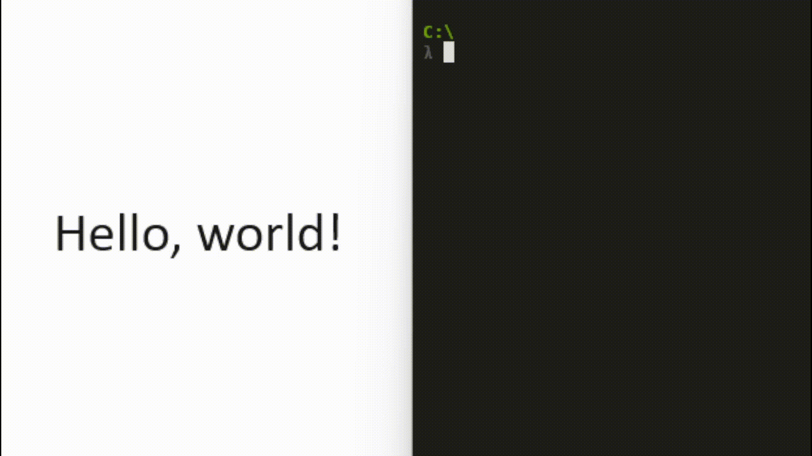

# tess

Simple cli wrapper for [Tesseract](https://tesseract-ocr.github.io/tessdoc/Installation.html).

The wrapper simply passes all cli arguments to Tesseract but adds an input and output option `clip`. Input to pass an image from your clipboard as input to Tesseract, and output to copy text output from Tesseract to your clipboard.

**Note:** If you want a library for production use in your go program then you should instead use [gosseract](https://github.com/otiai10/gosseract).

## Why?

I wanted a quick and easy way to extract text from snipped images. For example, have you ever wanted to grab a UUID from a screenshot? How about grab text from an image of a PDF?

## Installation

Install [Tesseract](https://tesseract-ocr.github.io/tessdoc/Installation.html) and put it in your `$PATH`.

Ensure `$GOPATH/bin` is in your `$PATH`.

Install `tess` with the following command:

```bash
go install github.com/travisyeah/tess
```

## Example

Add an image to your clipboard (e.g. by snipping) then run the following command to extract text from the image and print it to `stdout`:

```bash
tess
```



## Documentation

Use the [Tesseract Documentation](https://github.com/tesseract-ocr/tessdoc?tab=readme-ov-file#tesseract-user-manual) or get the documentation from the command line:

```bash
tess --help
```

**Note:** Default arguments for `in`/`out` are both `clip` if no arguments are given.
